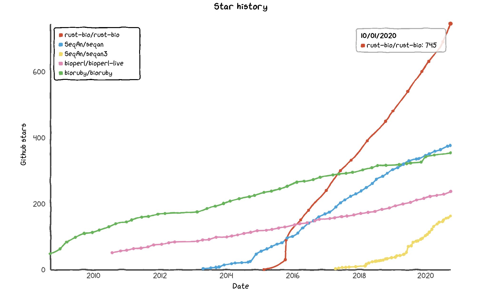

# Preamble {-#preamble}

## Rationale {-#rationale}

Bioinformatics algorithms and utilities are implemented in many programming languages. Notable libraries include SeqAn (C++), Biopython, Bioperl and BioRuby.

Production-ready bioinformatics libraries (obviously) tend to provide only the most efficient algorithm for every problem in bioinformatics. It is only to a limited extent can their source code and documentation help learning bioinformatics properly.

On the other hand, bioinformatics textbooks typically introduce readers to only a few historically important algorithms, which often do not represent the current most efficient solution. Take pairwise alignment for example:

|       Author        |               features               | Jones & Pevzner (2004) | Sung (2010) |
| :-----------------: | :----------------------------------: | :--------------------: | :---------: |
|  Needleman-Wunsch   |      global, **_O(nm)_** space       |           ✅            |      ✅      |
|   Smith-Waterman    |       local, **_O(nm)_** space       |           ✅            |      ✅      |
|        Gotoh        |    affine gap, **_O(nm)_** space     |           ✅            |      ✅      |
|      Hirshberg      |       global, **_O(n)_** space       |           ✅            |      ✅      |
| Myers-Miller (1988) | global, affine gap, **_O(n)_** space |           ❌            |      ❌      |
|    Huang (1991)     | local, affine gap, **_O(n)_** space  |           ❌            |      ❌      |
| `(more to be added` |                                      |                        |             |

I learn bioinformatic not only from textbooks but also from articles, and I found it enlightening to implement the variety of algorithms not mentioned in textbooks. I thought would be wasteful to discard these implementations after I've mastered their principles, so I created this repository in the hope that thses will help other bioinformatics learners.

## Why Rust? {-}

Personally, I think **Rust is the best programming language for bioinformatics**, for several simple but justifiable reasons:

- Python is slow. I do not say that Python is a bad language. Python is a great language for begginners in programming thanks to its simple syntax, and is also useful in situations where the program's API is fast-changing, especially in web services. On the contraty, in bioinformatics, execution speed is the priority, and the algorithms are updated relatively slowly, some of which haven't been improved for years). The same argument applies to Ruby, Perl, etc.
- Rust is **really fast.** According to [the computer language benchmarks game](https://benchmarksgame-team.pages.debian.net/benchmarksgame/which-programs-are-fastest.html), Rust is already in the same tier as C and C++ (the other two emerging compiled languages, Julia and Go, is about 1.5 and 2.5 times slower).
- Rust is **much easier to write than C/C++**. Well, frankly, I can't write C/C++. As a biochemistry specialist with only programming experience in Python, R and Javascript, I felt uncomfortable while I was struggling to learn C/C++ for the following reasons:

  - There isn't a central package registry/index equivalent to **PyPI**, **CRAN** or **npm**.
  - [There isn't even an "official documentation", ](https://stackoverflow.com/questions/34967756/where-is-the-official-c-documentation#:~:text=C%2B%2B%20is%20not%20a%20product%20and%20there%20is,etc.%29.%20–%20sorush-r%20Jan%2023%20%2716%20at%2019%3A28) not to mention an official tutorial. Popular books, such as *C++ Primer* by Stanley B. Lippman et al and *The C++ Standard Library* by Nicolai M. Josuttis, are not free. In contrast, many easy-to-read and up-to-date official or community resources exist for Python, JS and R, such as [javascript.info](https://javascript.info) and [r4ds](https://r4ds.had.co.nz). In fact, an important reason I like R is its ease of sharing and obtaining knowledge thanks to RMarkdown and [Bookdown](https://bookdown.org).

  I was wondering, **"do low-level, fast languages have to be that inconvinient? Even if a central package registry isn't suitable for reasons currently unknown to me, it is technically difficult even to provide an official tutorial?"** It turns out that the answer is "no"! Rust combines the best parts of C/C++ and the best parts of high-level programming languages. Honestly, I would say Rust's packaging and documentation system is even better than Python. In addition to its clean and easy syntax, Rust has official **tutorials** (not "documentation") [The Book](https://doc.rust-lang.org/book/) and [Rustonomicon](https://doc.rust-lang.org/nomicon/). With all these nice features, Rust isn't much more difficult to write than Python, at least for me. Rust deserves to be the most loved language according to [Stack Overflow's survey](https://insights.stackoverflow.com/survey/2020#technology-most-loved-dreaded-and-wanted-languages-loved) for 5 years running.
- To summarise, bioinformatics algorithms need to be fast, and biologists (or anyone not specialised in computer science itself) want simple stuff. The language that best fits the two criteria is definitely Rust.

As a reference, here is the star history of **Rust-Bio** and a few other bioinformatics package suites:

```{r echo=FALSE, out.width="100%"}

```

# Introduction {-}

## Organsation of the Source Code {-}

- Organised into this hierarchical order: `category/[subcategory]/problem/solution.rs`, where each `problem` usually have multiple `solution`s, ranging from "naïve" ones to advanced, practical ones.
- Implementation details will be documented thoroughly in rustdoc. The documentation should guide the readers to implement the algorithms themselves.
- Most solutions have corresponding original literature, and readers are encouraged to read them.
- Comments in the source code will be verbose.
- Clarity is more important than efficiency (although an optimised solution will be provided for each problem)
- All functions, structs, etc. are made public so that you can play around with them easily, but it should be emphasized again that you should not depend on any part of this repository for your development. Use **rust-bio** instead.

## Reading this Book {-}